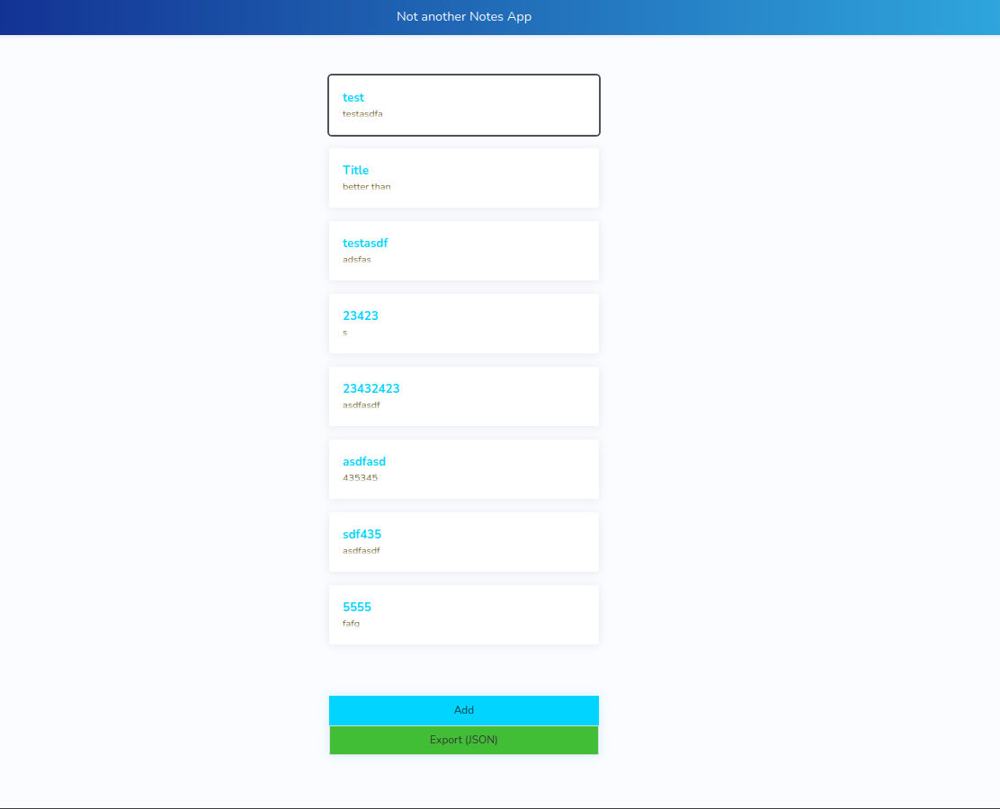

# Dokumentation Notes-App

## Einleitung

In der Programming Lab Blockwoche HS2022 wurde den
Teilnehmenden diverse Themen im Bereich der Webtechnologien vermittelt.

Von Ansätzen und Architekturen zu JavaScript und Typescript, Angular über Authentication 
und Weiteres vermittelt. Als Abschluss wird ein eigenes Webprojekt umgesetzt.

Im folgenden Kapitel "Architekturdokumentation", wird die Architektur des
Webprojekts dokumentiert, danach folgt das "Fazit & Reflexion" und Anhänge wie
das Arbeitsjournal.

## Architekturdokumentation

## Einführung und Ziele
Die Aufgabe, die ich mir gestellt habe, war das Entwickeln einer simplen Notes-App.
Dabei ist die Grundidee, dass der Benutzer Notizen erstellen und bearbeiten kann.

Ausserdem ermöglicht die App, die Notizen hinter einem Passwort zu schützen.
### Anforderungen 

| User Story | Priority |
| --- | --- |
| Anmelden | Must |
| Notitz erfassen | Must |
| Notizen ändern | Should |
| Listen und Freitext | Could |
| Export JSON | Must |

### Nicht-Funktionale Anforderungen

| Anforderung | Beschreibung |
| --- | --- |
| Plattform-Unterstützung | Die Notes App soll für sowohl Desktop- als auch Mobile-Ansichten optimiert sein. |
| Ladezeit | Die Notes App soll innerhalb von 1 Sekunde geladen werden. |

### Randbedingungen

Die gegebenen Rahmenbedingungen sind vergleichsweise flexibel und bieten 
somit eine breite Bandbreite an Möglichkeiten bei der Umsetzung.
Diese Flexibilität kann neue Perspektiven auf Probleme und Lösungen zu eröffnen. 
Eine flexible Gestaltungsfreiheit eröffnet die Möglichkeit, kreativ zu sein und 
innovative Ideen zu entwickeln.

### Lösungsstrategie

| Nicht-funktionale Anforderung                                                    | Lösungsansätze                                                          |
|----------------------------------------------------------------------------------|-------------------------------------------------------------------------|
| Die Notes App soll für sowohl Desktop- als auch Mobile-Ansichten optimiert sein. | - Frontend mit Angular und Bulma  - Responsive Design               |
| Die Notes App soll innerhalb von 1 Sekunde geladen werden.                       | - Schlakes Design  - Verzicht auf grosse Resourcen wie z.B. Bilder. |

## Bausteinsicht

  

###  Frontend
Erreichbar unter `localhost:4200`.

### Backend 
Das Back-End besteht aus flask webserver, welches verschiedene API
anbietet. Der Service unter `localhost:5000` erreichbar. 

Sqlalchemy ist das Brückenstück, welche die Flask App mit einer SQLite Datenbank verbindet.
Die API wird im folgenden Abschnitt kurz zusammengefasst.

| Aufruf         | Beschreibung                                                                                                        | Methode(n)              |
|----------------| -------------------------------------------------------------------------------------------------------------------|------------------------|
| `/login`       | Authentifiziert Benutzer, die ihre Anmeldeinformationen senden.                                                      | POST                   |
| `/notes`       | Gibt alle Notizen zurück, die in der Datenbank gespeichert sind.                                                    | GET                    |
| `/note/title`  | Gibt die Notiz mit dem angegebenen Titel zurück.                                                                     | GET, PUT               |
| `/note`        | Erstellt eine neue Notiz mit den bereitgestellten Informationen.                                                     | POST                   |
| `/note/title` | Aktualisiert eine Notiz mit dem angegebenen Titel anhand der bereitgestellten Informationen.                         | PUT                    |

## Laufzeitsicht

### Inbetriebnahme der Applikation

Instruktionen zum Start des Servers und das Frontend zu starten sind dem Top-Level 
[`README.md`](https://github.com/cyrillkuettel/weblab/blob/master/README.md) zu entnehmen. Ein Unixoides System wird zwar nicht vorausgesetzt, die Kommandos gehen aber davon aus. 
Auf Windows müssen gegebenenfalls kleine Anpassungen gemacht werden.

# Verteilungssicht

Die Datenbank und die Webserver laufen auf demselben physischen System.
In der Praxis würde man wohl einen reverse proxy wie NGINX vornedran setzen. 
Das bietet einige Vorteil, wie z.B. fine-tuning des Caching, load-balancing etc.

  

## Querschnittliche Konzepte
Angular verwendet in der Regel das Reactive Programming Pattern 
und baut auf Observables auf, um die Kommunikation zwischen Komponenten zu handhaben.
Ein Observable ist ein Objekt, das asynchrone Datenströme repräsentiert
und Änderungen im Datenfluss an Abonnenten weitergibt. 
Komponenten können Observables abonnieren und auf Änderungen reagieren,
wodurch eine reaktive Programmierweise ermöglicht wird.

Zusätzlich dazu werden in diesem Projekt auch Interceptors eingesetzt. 
Bei sowohol Interceptors als auch Observables ist der Kontrollfluss auf den ersten Blick 
nicht ersichtlich. Vieles ist implizit gesteuert.

## Fazit und Reflexion

Bisher hatte ich Erfahrung mit Javascript, habe vor diesem Modul noch nie Frameworks
im Frontend eingesetzt. Das war gänzlich Neuland für mich.
 Aus diesem Grund war ein grosser Lerneffekt da, ich konnte einiges mitnehmen über Angular spezifisch und auch 
generelle Web Technologien.

Den Workflow mit Typescript habe ich als sehr positiv empfunden. 
Fehler im Code werden (nicht wie bei Javascript) zur Laufzeit, sondern schon vom 
Compiler früh erkannt. Ausserdem ist mir aufgefallen, dass die Stukturierung des Codes 
in Komponenten einige Vorteile mit sich bringt. Zum Beispiel ist die Suche viel einfacher. 

Ein weiterer Aspekt, welcher die Entwicklung sehr angenehm macht, ist die gute 
Unterstützung für Angular der IDE. Features wie "Springen zu Definition" 
funktionieren sehr gut, sogar aus einem HTML-File kann zu entsprechenden Variabeln 
gesprungen werden. 

Was auch sehr gut geklappt hat, war das Einbinden eines Python Webservers. Es hat funktioniert, 
dennoch würde ich es bei einem nächsten Projekt wahrscheinlich nicht mehr diesen Ansatz wählen.
Das Hinzufügen von Programmiersprachen in einem Projekt erhöht die Komplexität. In diesem Fall war
es nicht nur nicht notwendig, es hat auch zu etwas Mehraufwand geführt. Zum Beispiel gibt es keine Möglichkeit,
Code zwischen dem Frontend und Backend zu teilen. So wurde beispielsweise das Modell für eine "Note" einmal 
Typescript und einmal in Python definiert, und somit dupliziert.

### Mögliche Verbesserungen 
Die Zeitplanung in diesem Projekt hätte besser gemacht werden können. Das hat nicht gut geklappt.
Zu sehen ist das ganz einfach daran, dass am Tag der Abgabe noch viel gearbeitet wurde. 

### Herausforderungen

Bei online tutorials / Beispiel-Code zu Angular ist höchste vorsicht geboten. Je 
älter eine Resource ist, desto höher ist die Wahrscheinlichkeit, dass auch der 
dazugehörige Code nicht mehr funktioniert, weil die entsprechenden methoden deprecated 
sind. Hier ist es durchaus lohnenswert, bei seiner Suchmaschine das Datum so 
eingrenzen, dass Resultate, die nicht älter als 3 Jahre sind, gar nicht erst 
angezeigt werden. 

# Arbeitsjournal

| Datum     | Tätigkeit                                                                       | Zeit (h) | Kategorie                   |
|-----------|---------------------------------------------------------------------------------|----------|-----------------------------|
| 19.2.     | Initialisierung, erste grobe Projektstruktur                                    | 4        | Dokumentation / Entwicklung |
| 26.2.     | Frontend: Diverse Components                                                    | 8        | Entwicklung                 |
| 27.2.     | Frontend: Notizen übersicht                                                     | 2        | Entwicklung                 |
| 2.3.      | Frontend: Styles                                                                | 2        | Entwicklung                 |
| 3.3.      | Refactoring und Inbetriebnahme Dokumentiert im README                           | 1        | Dokumentation               |
| 5.3.      | Backend CRUD Funktionalität und div. Arbeiten Frontend                          | 15       | Entwicklung                 |
| 6.3.      | Backend CRUD                                                                    | 10       | Entwicklung                 |
| 8.3.      | Login Funktionalität und Export JSON von Notes. Dokumentation und Präsentation. | 12       | Dokumentation / Entwicklung |
| **Total** |                                                                                 | **54**   |                             |
